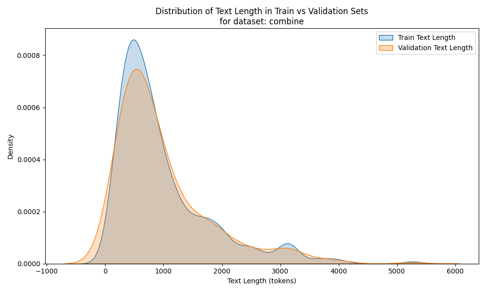

# Exploring Generalizability and Explainability of LLMs in Classifying Clinician Rated Suicidal Ideation Using Heterogeneous Data

## Overview
While artificial intelligence (AI) and large language models (LLMs) have shown promise in identifying and classifying suicidal ideation, their generalizability and equity in the presence of heterogeneous clinical data remain largely unexplored. This study hypothesized a subgroup disparity in a crude AI classifier of clinician-rated suicidal ideation because of the heterogeneity in language use and proposed a factorization approach to decompose complex data into simpler components by reducing the topic dimensions of clinical transcripts.

The workflow consists of two main steps:

1. **Data Processing**: Reduce topic dimension by identifying and extracting H11-only and non-H11 response text from clincial transcripts.
2. **Model Training**: Train transformer-based models (i.e., BERT) using the extracted text with 10-fold cross-validation, chunking (for sequences >512 tokens), overlapping (128 tokens), and early stopping (patience = 5). Evaluation metrics include AUC, Sensitivity, Specificity, PPV, and NPV.

***Computational Cost***: Estimated 10-20 GFLOPs per inference; training time is 6.7 mins for one classifier using a single GPU (NVIDIA GeForce RTX 5090 D).

---


## Repository Structure

| File / Data            | Description |
|--------------------------|-------------|
| `combine.csv`            | Metadata CSV containing all data, including H1 to H14 question contents, with case IDs, question numbers, text, and suicidal ideation labels. Not publicly available|
| `H11_data.csv`           | Processed dataset containing only H11 text and labels. Not publicly available|
| `nonH11_data.csv`        | Processed dataset containing excluded H11 texts and labels. Not publicly available.|
| `data_processing.py`     | Script to process HDRS transcripts and generate H11_data.csv,nonH11_data.csv. |
| `model_training.py`      | Script for training BERT-based classifiers on the processed dataset |
| `requirements.txt`       | List of Python dependencies required to run the scripts. |

---

## Data Processing

### Steps
1.	Load combine.csv, which contains case IDs, question numbers (H1 to H14), text (HDRS transcripts), and labels (0 or 1).
2.	Identify the H11-only and non-H11 question section and extract & save the corresponding responses text as H11_data.csv and nonH11_data.csv respectively.
3.	Load the corresponding csv files to train the topic-general classifier, mood-related classifier and suicide-specific classifier.

###

#### Predicted Probability Distribution


#### CLS Embedding Norm Distribution


---

### Run
```bash
# Run data processing
python data_processing.py

# Run model training
python model_training.py

